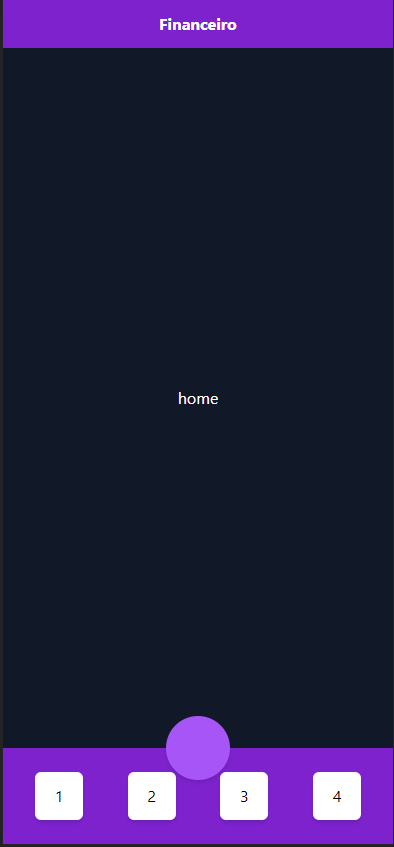

# About
I realized that I needed a project to show what I'm capable of. 
So this project mean to demonstrate all my current work stack, and also to be an useful financial control app.

**This project is an work in progress**

To the backend and APi, I decided to use Laravel, is a robust framework, on my main language, this will save me a lot of time.
As my intent is to make this a PWA, to the fronend I decided to use ReactJs, in order to reuse components, and have a non reload behavior to a better user experience. 

---

### Programing Languages
> - Typescript
> - PHP 
---

### Libraries / Frameworks / Template builders 
> - ReactJs 
> - Laravel 
> - Tailwindcss
---

### Environment 
> - Docker 
---

## In the future
> - Api endpopints docs
> - More Screens images
---

# Screens
>
> ## Home / App initial Layout
>

>  
>
